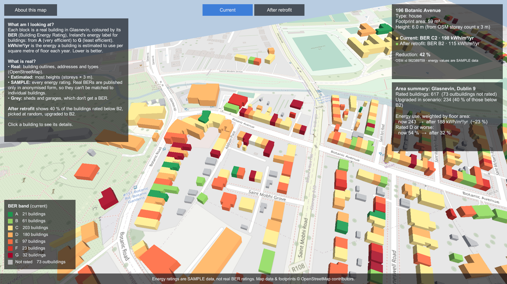
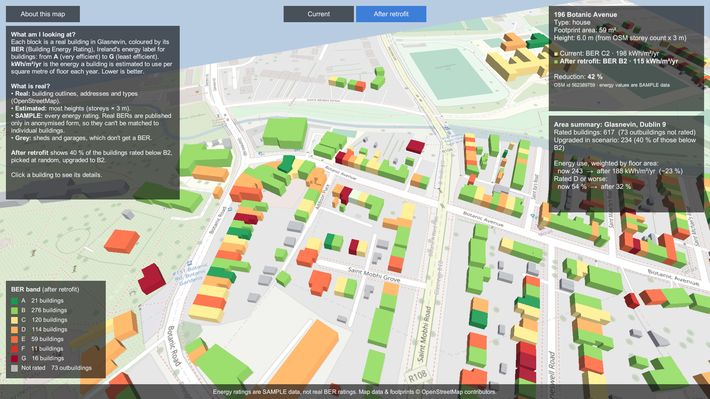
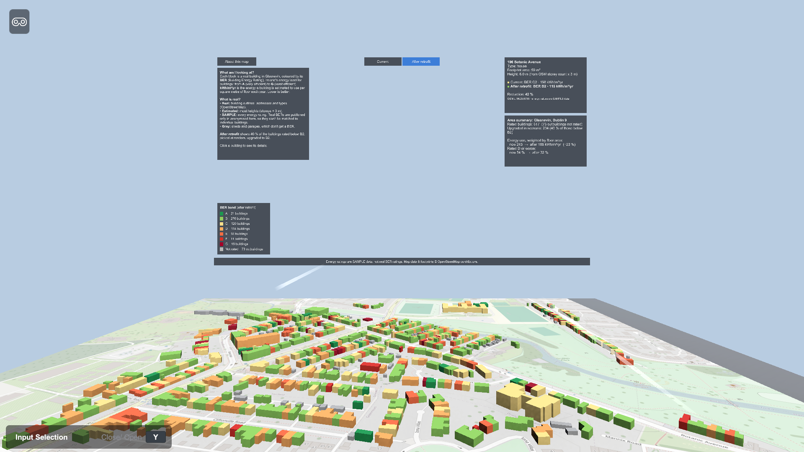

# Dublin Retrofit XR

A Unity 6 prototype that shows a real Dublin neighbourhood (Glasnevin, Dublin 9) as 3D
buildings coloured by energy rating, so anyone can click a building and compare the area
**now** with the same area **after a retrofit programme**.

> **Energy ratings are SAMPLE data, not real BER ratings.**
> Map data & footprints © OpenStreetMap contributors (ODbL).

| Current | After retrofit |
|---|---|
|  |  |

## Why

Building renovation is easier to discuss when people can *see* its effect on their own
street. This prototype explores that idea at a small, honest scale: real building
footprints on a real street map, a familiar energy label (Ireland's BER scale, A1–G), and a
one-click comparison between today and a renovation scenario. It is a first step towards
citizen-facing XR / digital-twin tools for retrofit planning.

## What it does

- 690 real buildings from OpenStreetMap, beside the National Botanic Gardens (Botanic
  Avenue, Walsh Road, Saint Mobhi Road, ...), extruded to 3D on the matching OSM street map.
- Buildings coloured by BER band (A = green → G = red); sheds and garages, which don't get
  a BER, are grey. Live legend with counts per band.
- Click a building: address, type, footprint, height (and whether it is estimated), BER
  and kWh/m²/yr now and after retrofit, % reduction. Hover highlights; **F** focuses.
- **Current / After retrofit** toggle recolours the area and updates every panel.
- Area summary: floor-area-weighted energy use and share of buildings rated D or worse,
  now vs after.
- **About this map** panel explains BER and kWh/m²/yr in plain language and says exactly
  which data is real, estimated or sample.
- **XR tabletop scene** (`MainXR.unity`): the same model at 1:500 on a table, with the
  panels on a board behind it; controller rays hover/select buildings and press the buttons.

Controls: right-drag orbit · middle-drag pan · scroll zoom · left-click select · F focus.

## How it works

```
data/build_dataset.py  ──► Assets/StreamingAssets/buildings.json
data/build_basemap.py  ──► Assets/Textures/basemap.png

DatasetLoader ──► ScenarioState ◄── SelectionController (hover / click raycasts)
                    │   ▲  └──────◄ ScenarioToggle (Current / After retrofit)
        events      │   │
    ┌───────────────┼───┴──────────────┐
CityBuilder     BuildingView     InfoPanel, Legend, AboutPanel
 (PolygonTriangulator +          (read state, redraw on events)
  BuildingMeshFactory)
```

- **ScenarioState** is the single source of truth (dataset, scenario, hovered, selected)
  and raises C# events; no script talks to another directly.
- **Geometry**: each footprint is triangulated by ear clipping for the roof, and every edge
  becomes an outward-facing wall quad. Unity treats clockwise triangles as front faces, so
  the counter-clockwise roof triangles are reversed.
- **Rendering**: one shared URP Lit material; per-building colour via `MaterialPropertyBlock`
  (no material copies). The street map is an unlit textured quad.
- **UI** is built in code with uGUI (`UiFactory`); the scene only holds components.
  `Dublin Retrofit → Rebuild Scenes` regenerates both scenes.

## XR mode



`Assets/Scenes/MainXR.unity` shows the neighbourhood as a tabletop model, the usual way to
present a neighbourhood-scale digital twin in VR. It is built with the **XR Interaction
Toolkit 3.6** (Starter Assets rig) and includes the **XR Interaction Simulator**, so it runs
without a headset.

- Every building gets an `XRSimpleInteractable` (`XrBuildingInteraction`), whose hover/select
  events call the same `ScenarioState` methods as the mouse, so colours and panels behave
  identically in desktop and XR.
- The panels are the same code as the desktop HUD, on a world-space canvas with a
  `TrackedDeviceGraphicRaycaster`, so controller rays can press the scenario buttons.
- The rig uses the *Device* tracking origin with a fixed 1.4 m eye height, so the table sits
  at a comfortable height seated, standing or in the simulator.

**What has been verified:** the scene compiles, runs and renders in a desktop build with the
simulator (screenshot above, captured automatically). **Not verified yet:** hovering and
selecting buildings with the simulated controller ray by hand; it has **not been run on a
VR headset**, and OpenXR is not configured. To try a headset, add
`com.unity.xr.openxr` and enable OpenXR under Project Settings → XR Plug-in Management.

## Data

| Field | Source |
|---|---|
| Footprints, addresses, types | OpenStreetMap via the Overpass API (bbox 53.3690–53.3735 N, 6.2700–6.2610 W) |
| Ground map | OpenStreetMap standard tiles (zoom 18, 80 tiles, downloaded once), cropped and lightened |
| Height | OSM `height`, else `building:levels` × 3 m, else a default by building type (61 % of buildings) |
| BER, kWh/m²/yr | **Synthetic.** Seeded random draw on the SEAI BER scale, weighted towards C/D to resemble older housing stock |
| Not rated | Sheds, garages and similar outbuildings (73) get no energy values |
| Retrofit scenario | **Assumption.** 40 % of rated buildings worse than B2, chosen at random, move to B2 (115 kWh/m²/yr) |

Result on this data: energy use 243 → 188 kWh/m²/yr (floor-area weighted), buildings rated
D or worse 54 % → 32 %. These numbers illustrate the tool; they are **not findings about
Glasnevin**.

**Why not real BERs?** SEAI publishes BER records only in anonymised form (no addresses),
so ratings cannot be matched to individual buildings. A natural next step is to calibrate
the sample distribution to SEAI's published records for Dublin 9.

```bash
python3 data/build_dataset.py            # fetch from Overpass (or --offline: use data/osm_raw.json)
python3 data/build_basemap.py            # ground map image, cropped to meta.basemap
```

## Tests

EditMode tests (`Assets/Tests/EditMode`) cover triangulation (square, concave L-shape,
collinear points), face winding of the generated meshes, the BER thresholds, and the real
dataset: every roof's area matches its footprint and the energy fields obey the scenario
rules. Run them from Window → General → Test Runner, or:

```bash
Unity -batchmode -projectPath . -runTests -testPlatform EditMode -testResults results.xml
```

## Running it

1. Open the folder with Unity 6 (developed with 6000.6.3f1) via Unity Hub.
2. Desktop: open `Assets/Scenes/Main.unity` and press Play.
3. XR: open `Assets/Scenes/MainXR.unity` and press Play; the XR Interaction Simulator's
   on-screen panel (toggle with Y) shows its keyboard/mouse controls.

`Dublin Retrofit → Rebuild Scenes` regenerates both scenes from code.

README screenshots are reproducible: run a build with `-capture <folder>`.

## Limitations

- Energy data is synthetic; the summary demonstrates the method, not the area.
- Flat roofs only; most heights are estimated; OSM multipolygon buildings are skipped.
- XR mode is untested on headsets (see XR mode).

## Next steps

- **XR on device**: configure OpenXR and test on a headset; add hand tracking.
- **Digital twin**: every building is georeferenced (`meta.originLat/Lon`), so the layer
  could sit on a photorealistic city model (e.g. Cesium / Google 3D Tiles) and be fed with
  measured or modelled energy data instead of samples.
- **Participation**: let residents mark their own building's planned upgrades and see the
  area total change.

## Licence

Code: MIT (see `LICENSE`). Map data and footprints: © OpenStreetMap contributors, ODbL.
`Assets/Samples/XR Interaction Toolkit` contains Unity's XRI samples under the
Unity Companion License.
